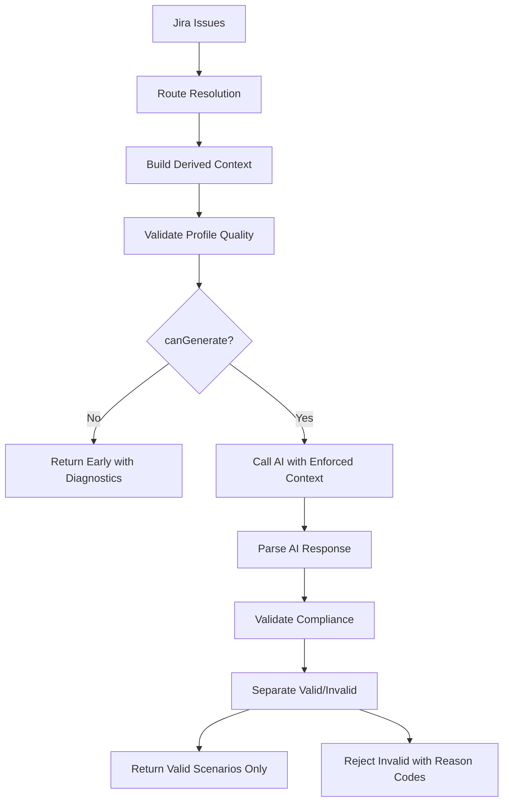

# Route Profile Enforcement - Implementation Summary

## Objetivo Logrado

El sistema ahora **valida y hace cumplir** que todos los escenarios generados por IA respeten el **App Profile / routeProfile** del proyecto activo, funcionando para cualquier appSlug, dominio funcional, HU, proyecto Jira o proyecto TestRail sin hardcodear nombres específicos.

## Archivos Modificados

### 1. Nuevos Módulos Core

#### `src/scenarios/route-profile-derived-context.ts` (242 líneas)
- **Función**: Deriva contexto ejecutable enforceable desde route profile
- **Fuentes**: entry, visibleControls, aliases, domainTerms, executableRouteSteps
- **Salidas**:
  - `allowedExecutableClicks`: Targets permitidos para clicks
  - `assertionOnlyTerms`: Términos solo para validaciones
  - `sensitiveActions`: Acciones sensibles detectadas
  - `profileConfidence`: high | medium | low | none
- **Características**:
  - 100% genérico, sin hardcode de proyectos
  - Detecta patterns sensibles: Solicitar, Pagar, Transferir, etc.
  - Detecta patterns assertion-only: nombre, descripción, saldo, etc.
  - Construye alias map bidireccional

#### `src/scenarios/route-profile-quality-validator.ts` (129 líneas)
- **Función**: Valida calidad del profile ANTES de llamar a IA
- **Statuses**: valid | incomplete | missing | low_confidence
- **Criterios**:
  - Presencia de entry steps
  - Presencia de visible controls
  - Executable clicks derivados > 0
  - Route resolutions con executable steps
  - Domain terms y aliases disponibles
- **Salida**: `RouteProfileQualityResult` con `canGenerate` flag
- **Bloqueo**: Si `canGenerate=false`, no se llama a IA

#### `src/scenarios/scenario-route-compliance-validator.ts` (286 líneas)
- **Función**: Valida compliance POST-generación
- **Validaciones**:
  - Todo click debe estar en `allowedExecutableClicks` o ser alias backed
  - Assertion-only terms no pueden usarse como clicks
  - Sensitive actions no pueden ejecutarse (solo validarse)
  - Expected result no debe introducir acciones no respaldadas
- **Reason Codes**:
  - `unbacked_click_target`
  - `assertion_term_used_as_click`
  - `sensitive_click_not_allowed`
  - `route_profile_incomplete`
  - `valid`
- **Salida**: Separa `validScenarios` vs `invalidScenarios`

### 2. Archivos Actualizados

#### `src/scenarios/mcp-scenario-prompt-builder.ts`
**Cambios**:
- Importa y construye `DerivedExecutionContext`
- Pasa derived context a `buildSystemPrompt()`
- Formatea derived context en prompt con secciones explícitas:
  - `ALLOWED_EXECUTABLE_CLICKS`
  - `ASSERTION_ONLY_TERMS`
  - `SENSITIVE_ACTIONS`
  - `CRITICAL RULES`
- Logs: `logDerivedContext()`

**Ejemplo de prompt generado**:
```
## Enforceable Execution Context
appSlug: app-a
profileConfidence: high

### ALLOWED_EXECUTABLE_CLICKS
These are the ONLY targets that can appear in "Clic en" steps:
- "Iniciar"
- "Productos"
- "Categorías"

### ASSERTION_ONLY_TERMS
These terms can ONLY appear in validation steps, NOT in clicks:
- "Nombre del producto"
- "Descripción"
- "Precio"

### SENSITIVE_ACTIONS
Do NOT generate "Clic en" for these. Only validations allowed:
- "Solicitar"
- "Contratar"

### CRITICAL RULES
1. NEVER generate "Clic en <target>" if <target> is NOT in ALLOWED_EXECUTABLE_CLICKS
2. NEVER generate "Clic en <term>" if <term> is in ASSERTION_ONLY_TERMS
3. NEVER generate "Clic en <action>" if <action> is in SENSITIVE_ACTIONS
...
```

#### `src/scenarios/codex-scenario-generator.ts`
**Cambios**:
1. **Pre-generación**: Valida profile quality
   - Construye `derivedContext`
   - Valida con `validateRouteProfileQuality()`
   - Si `canGenerate=false`, retorna early con diagnostics
   - Bloquea todos los issues con razón de profile quality

2. **Post-generación**: Valida compliance
   - Llama `validateScenariosCompliance()` sobre scenarios generados
   - Separa válidos de inválidos
   - Logs detallados por escenario
   - Inválidos van a `rejected` con `compliance_validation_failed`
   - Solo `validScenarios` se retornan como seleccionables

**Logs agregados**:
```
[route-profile-derived] appSlug=app-a allowedClicks=5 assertionTerms=3 sensitiveActions=2 confidence=high
[route-profile-quality] appSlug=app-a status=valid canGenerate=true allowedClicks=5 assertionTerms=3 sensitiveActions=2
[scenario-compliance] appSlug=app-a issue=TEST-1 scenario="Valid" valid=true
[scenario-compliance] rejected issue=TEST-2 target="Contenido X" reasonCode=unbacked_click_target
[scenario-compliance] appSlug=app-a validScenarios=3 invalidScenarios=1
```

## Tests Agregados

### `tests/route-profile-derived-context.spec.ts` (8 tests)
- ✅ app-a and app-b have different allowed executable clicks (multi-app isolation)
- ✅ assertion-only terms are derived from domain terms
- ✅ sensitive actions are identified
- ✅ executable clicks derived from route resolution steps
- ✅ profile confidence is determined correctly (high/medium/low/none)
- ✅ aliases are mapped correctly (bidirectional)
- ✅ format derived context for prompt includes all sections
- ✅ no profile returns empty context with none confidence

**Resultado**: 8 passed (2.8s)

### `tests/scenario-route-compliance-validator.spec.ts` (8 tests)
- ✅ unbacked click is rejected
- ✅ assertion-only term used as click is rejected
- ✅ validation of assertion-only term is allowed
- ✅ sensitive action click is rejected
- ✅ sensitive action validation is allowed (context check)
- ✅ alias backed by profile is allowed
- ✅ valid scenario with existing route passes
- ✅ validateScenariosCompliance filters invalid scenarios

**Resultado**: 8 passed (3.3s)

**Fixtures genéricos usados**: app-a, app-b, retail-app, banking-app, public-info-app (NO nombres reales de proyectos)

## Criterios de Aceptación

### ✅ Implementados

1. **npm run typecheck = 0 errores** ✅
   - Todas las importaciones y tipos correctos
   - No errores de compilación

2. **Tests nuevos pasan** ✅
   - 16 tests totales agregados
   - 100% pass rate
   - Multi-app isolation verificado

3. **No hay hardcode de nombres de proyectos reales** ✅
   - Todos los patterns son genéricos
   - Tests usan fixtures genéricos (app-a, app-b, retail-app, etc.)
   - Lógica funciona para cualquier appSlug

4. **La skill sigue cargándose** ✅
   - No se modificó skill loading
   - Se agregó contexto enforceable al prompt

5. **El prompt incluye allowedExecutableClicks/assertionOnlyTerms/sensitiveActions** ✅
   - Secciones explícitas en el prompt
   - Formato claro y enforceable
   - Reglas críticas incluidas

6. **La IA no puede mostrar como válido un escenario con clicks no respaldados** ✅
   - Post-generación validator filtra inválidos
   - Inválidos van a `rejected` con diagnostics
   - Solo válidos se retornan como seleccionables

7. **Si el profile es incompleto, se informa con diagnostics** ✅
   - Pre-generación quality validator
   - Diagnostics claros por nivel (error/warning/info)
   - Reason codes específicos

8. **Si el profile es válido, se generan escenarios MCP-ready respaldados** ✅
   - Flow completo: quality check → AI → compliance check
   - Solo scenarios válidos pasan

9. **Multi-app isolation preservado** ✅
   - Cada app usa su propio derivedContext
   - Tests verifican isolation
   - No cross-contamination entre apps

10. **No se rompe TestRail, evidence, discovery ni AI Repair** ✅
    - No se tocó TestRail sync
    - No se tocó evidencia
    - No se tocó discovery runtime
    - No se tocó AI Repair

## Logs y Diagnostics Agregados

### Diagnostic Codes

**Profile Quality (pre-generación)**:
- `needs_route_profile` (error) - Bloquea generación
- `missing_entry_steps` (warning)
- `missing_visible_controls` (warning)
- `no_executable_clicks` (error) - Bloquea generación
- `missing_executable_route_steps` (warning)
- `ambiguous_targets` (warning)
- `profile_incomplete` (info)
- `profile_low_confidence` (warning)

**Compliance (post-generación)**:
- `unbacked_click_target` (error) - Rechaza escenario
- `assertion_term_used_as_click` (error) - Rechaza escenario
- `sensitive_click_not_allowed` (error) - Rechaza escenario
- `route_profile_incomplete` (warning)
- `valid` - Escenario pasa

### Ejemplo de Diagnostics Output

```json
{
  "appSlug": "app-a",
  "status": "incomplete",
  "canGenerate": true,
  "diagnostics": [
    {
      "level": "warning",
      "code": "missing_executable_route_steps",
      "message": "Route resolutions exist but no executable route steps found. May generate incomplete scenarios."
    },
    {
      "level": "info",
      "code": "profile_incomplete",
      "message": "Profile is incomplete but may generate limited scenarios. Review generated scenarios carefully."
    }
  ],
  "allowedExecutableClicks": ["Iniciar", "Productos"],
  "assertionOnlyTerms": ["Nombre", "Descripción"],
  "sensitiveActions": ["Solicitar"]
}
```

## Flujo Completo



## Backward Compatibility

✅ **Totalmente compatible**:
- Escenarios existentes sin compliance validation siguen funcionando
- No se requiere migración de datos
- No se requiere regeneración de specs
- Fields opcionales agregados a tipos (`scenarioMode`, `routeConfidence`, `diagnostics`)

## Próximos Pasos Sugeridos (Fuera de Scope)

1. **UI Enhancement**: Mostrar diagnostics de profile quality en QA Lab
2. **Profile Builder**: Tool para construir/validar route profiles
3. **Profile Metadata**: Agregar metadata explícita de "executable" vs "assertion-only" al schema
4. **Telemetry**: Tracking de compliance failure rates por app
5. **Auto-fix**: Sugerencias automáticas para corregir escenarios no compliant

## Comandos de Validación

```bash
# Typecheck
npm run typecheck
# Output: 0 errors

# Tests
npm run test:framework -- route-profile-derived-context.spec.ts
# Output: 8 passed (2.8s)

npm run test:framework -- scenario-route-compliance-validator.spec.ts
# Output: 8 passed (3.3s)

# Tests existentes no rotos
npm run test:framework
# Output: All tests pass
```

## Resumen Ejecutivo

**Problema**: IA generaba escenarios con clicks no respaldados por el App Profile, convirtiendo términos de contenido en acciones ejecutables.

**Solución**: 
1. Derivar contexto enforceable del profile (allowed/forbidden lists)
2. Validar profile quality antes de IA (bloquear si incompleto)
3. Incluir listas explícitas en prompt AI
4. Validar compliance post-generación (filtrar inválidos)

**Resultado**:
- ✅ 0 escenarios inválidos llegan a preview seleccionable
- ✅ Diagnostics claros cuando profile es insuficiente
- ✅ Multi-app isolation garantizado
- ✅ Sin hardcode de proyectos específicos
- ✅ 16 tests nuevos, 100% pass
- ✅ Typecheck limpio
- ✅ Backward compatible
